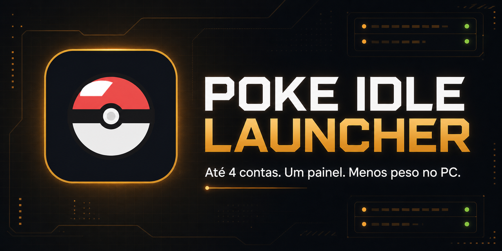

<div align="center">

# Poke Idle Launcher

**Launcher open source para a comunidade do [Poke Idle World](https://poke.idleworld.online/play).**
Acompanhe até quatro contas em uma só janela, com painel de métricas ao vivo, alertas e ferramentas — tudo lendo apenas o que o próprio jogo já envia.



[](LICENSE)


</div>

## Baixar

### ⬇ [Windows (.exe)](https://github.com/AntonioFleck/poke-idle-launcher/releases/latest/download/Poke-Idle-Launcher-Windows-x64.exe) &nbsp;·&nbsp; [Linux x64 (.AppImage)](https://github.com/AntonioFleck/poke-idle-launcher/releases/latest/download/Poke-Idle-Launcher-Linux-x64.AppImage) &nbsp;·&nbsp; [Linux ARM (.AppImage)](https://github.com/AntonioFleck/poke-idle-launcher/releases/latest/download/Poke-Idle-Launcher-Linux-arm64.AppImage)

Os links acima **baixam sempre a versão mais recente**. Todas as versões ficam em **[Releases](../../releases/latest)**. Como o executável não tem assinatura digital paga, o Windows pode mostrar um aviso na primeira abertura (SmartScreen → *Mais informações* → *Executar assim mesmo*).

## Recursos

- Até quatro contas em grade ou foco individual, numa janela leve.
- Dashboard agregado com gold/h líquido, XP/h, kills/h, capturas, shiny e pokédex.
- Alertas de shiny, raridade alta, bolas e potions acabando, desconexão e time desmaiado.
- Feed de capturas, mochila por categoria, metas, profissão, chat do jogo e overlay flutuante.
- Proteção opcional contra venda acidental de itens e criaturas importantes.
- Filtro de nível rápido no Mapa e foco de digitação preservado.

## Como funciona

O launcher observa os frames WebSocket que o jogo já transmite e consulta endpoints de leitura do próprio jogo. **Não injeta comandos de automação, não joga por você e não usa o DOM do jogo como fonte de dados.** O único screenshot é do *seu* shiny, se você ativar. O formato normalizado dos dados está em [`docs/WS_SCHEMA.md`](docs/WS_SCHEMA.md).

## Rodar a partir do código

Requer Node.js 22.

```bash
npm ci
npm start
```

Para gerar os pacotes você mesmo:

```bash
npm run dist                    # instalador Windows x64
npm run dist:linux -- --x64     # AppImage Linux Intel/AMD
npm run dist:linux -- --arm64   # AppImage Linux ARM
```

Os arquivos finais ficam em `dist/`.

## Privacidade

Eventos, configurações, prints e sessões ficam **somente no seu computador**. Dados locais, tokens, caches, dependências e builds estão fora do Git. Nunca publique sua pasta de dados nem dumps de diagnóstico.

## Contribuindo

Pull requests são bem-vindos — abra uma issue ou PR com uma descrição reproduzível.

## Licença

[MIT](LICENSE). Projeto comunitário, gratuito e open source, sem vínculo oficial com o Poke Idle World.
